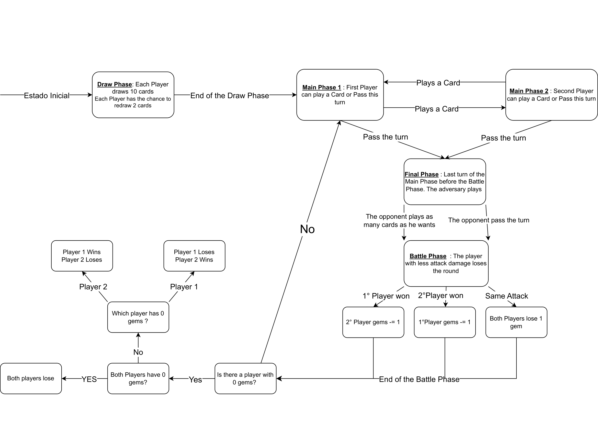

# Gwen't

## Disclaimer 
Este proyecto es una tarea para el curso CC3001-1 de la Universidad de Chile, dictado por el departamento de ciencias de la computación. El proyecto no está acabado, y su principal misión es conocer y entender *OOP* y sus metodologías de diseño y programación. La idea es crear un modelo ( y quizá funcional ) del minijuego de cartas Gwen't creado por CD Projekt.

### Índice
-[Diagrama de estados](#diagrama-de-estados)
-[Licencia](#licencia)

## Diagrama de estados

El diagrama de estados es una manera de visualizar los estados del juegos :

## Licencia

This work is licensed under a
[Creative Commons Attribution 4.0 International License](http://creativecommons.org/licenses/by/4.0/)

Context
-------

This project's goal is to create a (simplified) clone of the
[_Gwent_](https://www.playgwent.com/en)card game developed by [_CD PROJEKT RED_](https://cdprojektred.com/en/)

---

